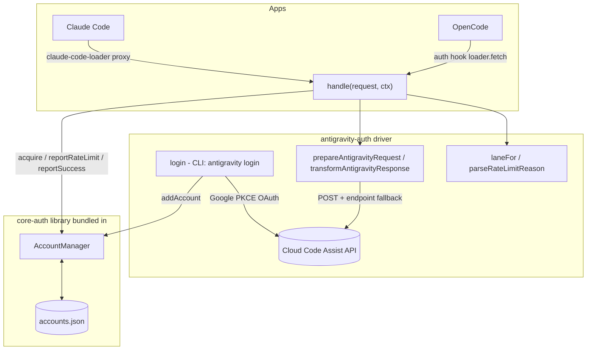

# antigravity-auth

[](https://www.npmjs.com/package/antigravity-auth)
[](https://www.npmjs.com/package/antigravity-auth)
[](https://github.com/intisy-ai/antigravity-auth/actions)

Google Antigravity provider for OpenCode and Claude Code, built as a thin driver on top of [core-auth](https://github.com/intisy-ai/core-auth). core-auth owns all the generic work — multi-account storage, selection/rotation, token refresh, and rate-limit/cooldown state — while this package supplies only the antigravity specifics: the request/response transform, the Cloud Code Assist endpoints, and the Google OAuth login. The same account pool is shared by both OpenCode and Claude Code.

## Under-the-Hood Architecture



## Driver Detail

The driver maps a requested model to a lane (`claude`, `gemini-antigravity`, `gemini-cli`), asks `AccountManager` for an account + fresh access token, builds the upstream request with the reused transform layer, and dispatches with endpoint fallback. On a rate-limit it reports the reset time to core and rotates; on success it transforms the response back to the caller's format.

## Structure

- `src/`
  - `index.ts` — OpenCode entry (the core-auth provider plugin)
  - `handler.ts` — Claude Code entry (`handle()` for the claude-code-loader proxy)
  - `cli.ts` — `antigravity login | list | remove`
  - `driver/` — `index.ts` (driver + `handle`), `config.ts`, `lanes.ts`, `migrate.ts`, `models.ts`, `login.ts`
  - `antigravity/oauth.ts`, `plugin/{request,request-helpers,project,transform/*,core/streaming/*,...}.ts` — the reused antigravity transform/request layer
  - `commands.ts` — cross-app slash-command definitions + their CLI actions
  - `core-auth/` — the core-auth library (git submodule, bundled into the output)
  - `core/` — shared [`intisy-ai/core`](https://github.com/intisy-ai/core) submodule (config + logging + command framework), bundled in
- `dist/`
  - bundled `index.js`, `handler.js`, `cli.js` (generated; not committed)

## Installation

### Via plugin-updater (recommended)

```bash
npx plugin-updater@latest init https://github.com/intisy-ai/antigravity-auth
```

### Via npm

```bash
npm install antigravity-auth
```

## Configuration

Config file: `<configDir>/config/antigravity.json` (edit via the loader or `/antigravity-config set`).

```json
{
  "quiet_mode": false,
  "toast_scope": "root_only",
  "debug": false,
  "debug_tui": false,
  "debug_gemini_payloads": false,
  "keep_thinking": false,
  "session_recovery": true,
  "auto_resume": true,
  "resume_text": "continue",
  "empty_response_max_attempts": 4,
  "empty_response_retry_delay_ms": 2000,
  "tool_id_recovery": true,
  "claude_tool_hardening": true,
  "claude_prompt_auto_caching": false,
  "proactive_token_refresh": true,
  "proactive_refresh_buffer_seconds": 1800,
  "proactive_refresh_check_interval_seconds": 300,
  "max_rate_limit_wait_seconds": 300,
  "quota_fallback": false,
  "cli_first": false,
  "fallback_enabled": false,
  "auto_mode": true,
  "account_selection_strategy": "hybrid",
  "pid_offset_enabled": false,
  "switch_on_first_rate_limit": true,
  "scheduling_mode": "cache_first",
  "max_cache_first_wait_seconds": 60,
  "failure_ttl_seconds": 3600,
  "default_retry_after_seconds": 60,
  "max_backoff_seconds": 60,
  "request_jitter_max_ms": 0,
  "soft_quota_threshold_percent": 90,
  "quota_refresh_interval_minutes": 15,
  "soft_quota_cache_ttl_minutes": "auto",
  "auto_update": true,
  "signature_cache": {
    "enabled": true,
    "memory_ttl_seconds": 3600,
    "disk_ttl_seconds": 172800,
    "write_interval_seconds": 60
  },
  "health_score": {
    "initial": 70,
    "success_reward": 1,
    "rate_limit_penalty": -10,
    "failure_penalty": -20,
    "recovery_rate_per_hour": 2,
    "min_usable": 50,
    "max_score": 100
  },
  "token_bucket": {
    "max_tokens": 50,
    "regeneration_rate_per_minute": 6,
    "initial_tokens": 50
  },
  "logging": true
}
```

| Key | Default |
| --- | --- |
| `quiet_mode` | `false` |
| `toast_scope` | `"root_only"` |
| `debug` | `false` |
| `debug_tui` | `false` |
| `debug_gemini_payloads` | `false` |
| `keep_thinking` | `false` |
| `session_recovery` | `true` |
| `auto_resume` | `true` |
| `resume_text` | `"continue"` |
| `empty_response_max_attempts` | `4` |
| `empty_response_retry_delay_ms` | `2000` |
| `tool_id_recovery` | `true` |
| `claude_tool_hardening` | `true` |
| `claude_prompt_auto_caching` | `false` |
| `proactive_token_refresh` | `true` |
| `proactive_refresh_buffer_seconds` | `1800` |
| `proactive_refresh_check_interval_seconds` | `300` |
| `max_rate_limit_wait_seconds` | `300` |
| `quota_fallback` | `false` |
| `cli_first` | `false` |
| `fallback_enabled` | `false` |
| `auto_mode` | `true` |
| `account_selection_strategy` | `"hybrid"` |
| `pid_offset_enabled` | `false` |
| `switch_on_first_rate_limit` | `true` |
| `scheduling_mode` | `"cache_first"` |
| `max_cache_first_wait_seconds` | `60` |
| `failure_ttl_seconds` | `3600` |
| `default_retry_after_seconds` | `60` |
| `max_backoff_seconds` | `60` |
| `request_jitter_max_ms` | `0` |
| `soft_quota_threshold_percent` | `90` |
| `quota_refresh_interval_minutes` | `15` |
| `soft_quota_cache_ttl_minutes` | `"auto"` |
| `auto_update` | `true` |
| `signature_cache` | `{"enabled":true,"memory_ttl_seconds":3600,"disk_ttl_seconds":172800,"write_interval_seconds":60}` |
| `health_score` | `{"initial":70,"success_reward":1,"rate_limit_penalty":-10,"failure_penalty":-20,"recovery_rate_per_hour":2,"min_usable":50,"max_score":100}` |
| `token_bucket` | `{"max_tokens":50,"regeneration_rate_per_minute":6,"initial_tokens":50}` |
| `logging` | `true` |

## Commands

| Command | Description | Arguments |
| --- | --- | --- |
| `/antigravity-config` | View and change antigravity configuration | `list | get <key> | set <key> <value>` |
| `/antigravity-accounts` | List signed-in Antigravity accounts |  |

## Dependencies

- `core`
- `core-auth`
- `sync-bridge`

## Logging

Logs are written to `<configDir>/logs/YYYY-MM-DD/antigravity-auth-HH-MM-SS.log` and are toggled by
this plugin's `logging` config (default on). Console mirroring is global, off by default,
and controlled by the shared `config/settings.json` `logConsole` flag.

## License

MIT.
