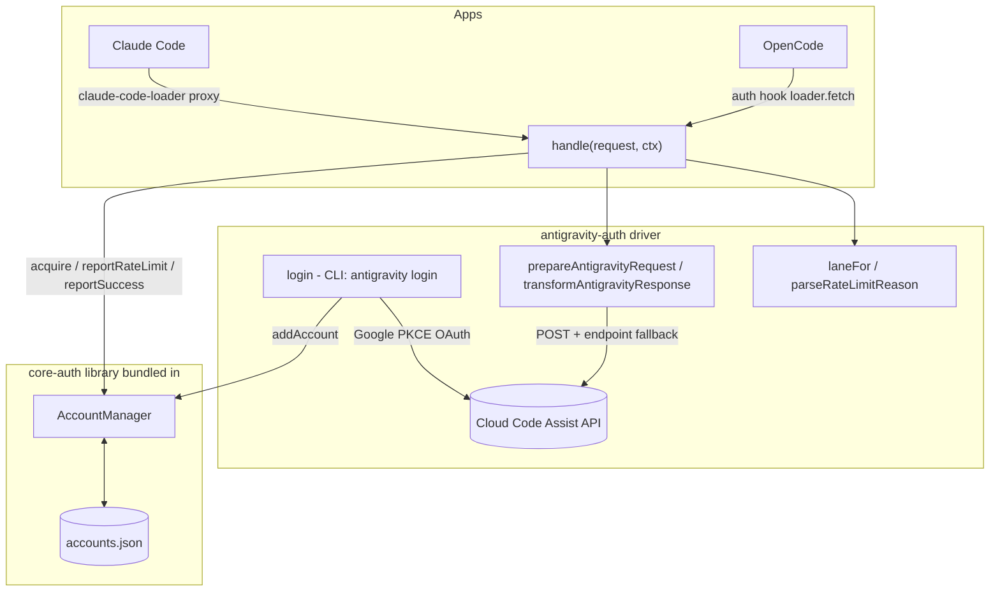

# antigravity-auth

[](https://www.npmjs.com/package/antigravity-auth)
[](https://www.npmjs.com/package/antigravity-auth)
[](https://github.com/intisy-ai/antigravity-auth/actions/workflows/publish.yml)

Google Antigravity provider for OpenCode and Claude Code, built as a thin driver on top of [core-auth](https://github.com/intisy-ai/core-auth). core-auth owns all the generic work — multi-account storage, selection/rotation, token refresh, and rate-limit/cooldown state — while this package supplies only the antigravity specifics: the request/response transform, the Cloud Code Assist endpoints, and the Google OAuth login. The same account pool is shared by both OpenCode and Claude Code.

## Under-the-Hood Architecture



The driver maps a requested model to a lane (`claude`, `gemini-antigravity`, `gemini-cli`), asks `AccountManager` for an account + fresh access token, builds the upstream request with the reused transform layer, and dispatches with endpoint fallback. On a rate-limit it reports the reset time to core and rotates; on success it transforms the response back to the caller's format.

## Structure

- `src/`
  - `index.ts` — OpenCode entry (the core-auth provider plugin)
  - `handler.ts` — Claude Code entry (`handle()` for the claude-code-loader proxy)
  - `cli.ts` — `antigravity login | list | remove`
  - `driver/` — `index.ts` (driver + `handle`), `config.ts`, `lanes.ts`, `migrate.ts`, `models.ts`, `login.ts`
  - `antigravity/oauth.ts`, `plugin/{request,request-helpers,project,transform/*,core/streaming/*,...}.ts` — the reused antigravity transform/request layer
  - `commands.ts` — cross-app slash-command definitions + their CLI actions
  - `core-auth/` — the core-auth library (git submodule, bundled into the output)
  - `core/` — shared [`intisy-ai/core`](https://github.com/intisy-ai/core) submodule (config + logging + command framework), bundled in
- `dist/` — bundled `index.js`, `handler.js`, `cli.js` (generated; not committed)

## Installation

### Via plugin-updater (primary)

Add an entry to `plugins.json` and let the loader clone + build it:

```json
{ "name": "antigravity-auth", "url": "https://github.com/intisy-ai/antigravity-auth", "enabled": true, "autoUpdate": true }
```

Then log in (writes to the shared core-auth account pool, used by both apps):

```bash
node ~/.claude/repos/antigravity-auth/dist/cli.js login
```

In OpenCode, run `oc auth login` once and pick **Antigravity** so OpenCode routes through the provider.

### Via npm

```bash
npm install -g antigravity-auth
antigravity login
```

## Configuration

> Config files are **never auto-created on launch** — settings are registered with defaults (core `defineConfig`) and edited in the loader's **Plugins → Configure** screen (or `/<plugin>-config`); a file is written only when you change a value. **Global console logging** for every plugin is toggled in `config/settings.json` (`logConsole: true`, the opencode.json-equivalent).

Config is read from, in order of preference:

1. `~/.config/opencode/config/antigravity.json` (Claude: `~/.claude/config/antigravity.json`)
2. `~/.config/opencode/antigravity.json` (fallback)

```json
{
  "account_selection_strategy": "hybrid",
  "logging": true
}
```

Every key is editable from chat via `/antigravity-config` (`list` / `get <key>` / `set <key> <value>`) — see Commands. Accounts live in the core-auth store at `<configDir>/config/accounts.json`. The OAuth client id/secret are read from `ANTIGRAVITY_CLIENT_ID` / `ANTIGRAVITY_CLIENT_SECRET` (env) when set, falling back to the built-in values.

## Commands

Deployed automatically to both apps on load (`~/.config/opencode/command/` and `~/.claude/commands/`):

| Command | Description |
| --- | --- |
| `/antigravity-config` | View/change any config key in `antigravity.json`: `list`, `get <key>`, `set <key> <value>`. 100% of the config is reachable here. |
| `/antigravity-accounts` | List signed-in Antigravity accounts and their enabled state. |

## Dependencies

- **`core`** (required) — bundled git submodule (config + logging + commands); no separate install.
- **`core-auth`** (required) — bundled git submodule (account store + provider framework).
- **`sync-bridge`** (optional) — if present, the account store is mirrored to the other app; absent, it no-ops.

## Logging

Logs are written to `<configDir>/logs/YYYY-MM-DD/antigravity-auth-HH-MM-SS.log`. Set `"logging": false` in the config file to disable.

## License

MIT
